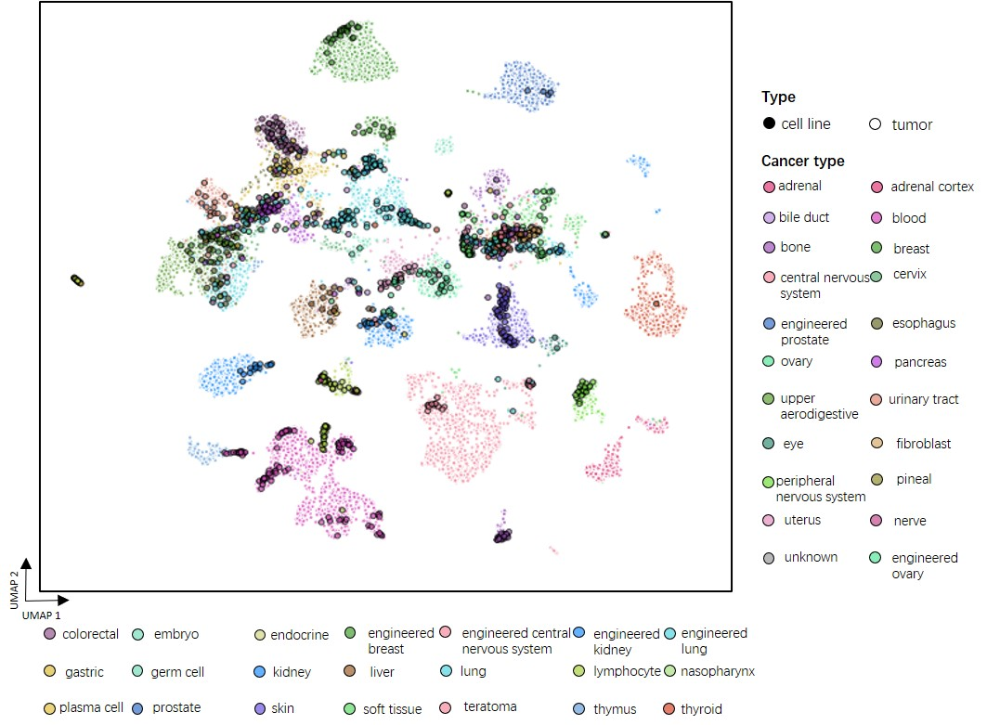

Alignment of Tumors and Cell Lines
==================================

In this tutorial, we show how to apply ``CellMirror`` to align bulk tumor samples and cancer cell lines. As an example, we directly downloaded the RNA-seq data of bulk tumor and cell line samples from `Warren, et al. 2021. <https://www.nature.com/articles/s41467-020-20294-x>`_, including 12,236 cancer samples with 33 cancer types, and 1,249 cell line samples with 34 cancer type. We directly utilized the normalized RNA-seq data by the previous study.

********************************
Step0: Loading packages (Python)
********************************

.. code-block:: python
    :linenos:

    import math
    import random
    import pandas as pd
    import numpy as np
    import scanpy as sc
    import datetime

    from CellMirror_utils.utilities import *
    from CellMirror_utils.layers import *
    from CellMirror_utils.cLDVAE_torch import *
    import torch.utils.data as data_utils

    parser = parameter_setting()
    args = parser.parse_known_args()[0]

    args.batch_size = 128
    args.lr_cLDVAE = 3e-6
    args.beta = 1
    args.gamma = -100

    np.random.seed(args.seed)
    random.seed(args.seed)
    torch.manual_seed(args.seed)
    torch.cuda.manual_seed(args.seed)

**********************************************
Step1: Reading and preprocessing data (Python)
**********************************************

The necessary input files includes:
1. The gene expression matrix;
2. Samples' attributes;
3. Genes' information.

First, we need to prepare the RNA-seq data of tumors and cell lines into ``AnnData`` objects. See `AnnData <https://anndata.readthedocs.io/en/latest/index.html>`_ for more details if you are unfamiliar, including how to construct ``AnnData`` objects from scratch, and how to read data in other formats(.csv, .mtx, etc.) into ``AnnData`` objects. Here, we compile a function `Load_data()` for loading all the aforementioned 3 types of files.

Then, we follow the ``scanpy`` pipeline for data preprocessing. See `scanpy <https://scanpy-tutorials.readthedocs.io/en/latest/pbmc3k.html>`_ for more details if you are unfamiliar. In this scenario, we select 5,000 highly variable genes for tumors and cell lines, respectively. 

To align the number of samples for tumors and cell lines, which will be used in Step2 for training model, we generate random cell line samples from a multivariate normal distribution with the mean vector and covariance matrix of cell line gene expression.

.. code-block:: python
    :linenos:

    # preprocessing
    result = load_data()

    TCGA_obj = sc.AnnData(X=result[1], obs=result[3], var=result[0])
    CCLE_obj = sc.AnnData(X=result[2], obs=result[4], var=result[0])

    sc.pp.highly_variable_genes(TCGA_obj, n_top_genes=5000)
    sc.pp.highly_variable_genes(CCLE_obj, n_top_genes=5000)
    common_HVGs=np.intersect1d(list(TCGA_obj.var.index[TCGA_obj.var['highly_variable']]),list(CCLE_obj.var.index[CCLE_obj.var['highly_variable']])).tolist()

    TCGA_obj, CCLE_obj = TCGA_obj[:,common_HVGs], CCLE_obj[:,common_HVGs]
    genes_info = TCGA_obj.var
    TCGA_obj_X_df = pd.DataFrame(TCGA_obj.X, index=TCGA_obj.obs.index, columns=genes_info.index)
    TCGA_obj_X_df = TCGA_obj_X_df - np.mean(TCGA_obj_X_df, axis=0)
    CCLE_obj_X_df = pd.DataFrame(CCLE_obj.X, index=CCLE_obj.obs.index, columns=genes_info.index)
    CCLE_obj_X_df = CCLE_obj_X_df - np.mean(CCLE_obj_X_df, axis=0)

    tumor_scale = TCGA_obj_X_df.values

    CL_scale = np.concatenate( (CCLE_obj_X_df.values, np.random.multivariate_normal(np.mean(CCLE_obj_X_df, axis=0), np.cov(CCLE_obj_X_df.T), len(TCGA_obj_X_df)-len(CCLE_obj_X_df))), axis=0 )

**Hyperparameters**

- n_top_genes: Number of highly-variable genes to keep.

*************************************
Step2: Training cLDVAE model (Python)
*************************************

Next, we train a cLDVAE model for aligning bulk tumor samples and cancer cell lines.

.. code-block:: python
    :linenos:

    # prepare dataloaders for cLDVAE

    background = (CL_scale).astype('float32')

    target = (tumor_scale).astype('float32')

    batch_size=args.batch_size

    train = data_utils.TensorDataset(torch.from_numpy(target),torch.from_numpy(background))
    train_loader = data_utils.DataLoader(train, batch_size=batch_size, shuffle=True)

    total = data_utils.TensorDataset(torch.from_numpy(target),torch.from_numpy(background))
    total_loader = data_utils.DataLoader(total, batch_size=batch_size, shuffle=False)

    # configurate cLDVAE

    input_dim=len(genes_info)
    intermediate_dim_en=[1000]
    intermediate_dim_de=[1000]

    s_latent_dim = 2
    z_latent_dim = 100

    salient_colnames = list(range(1, s_latent_dim + 1))
    for sColumn in range(s_latent_dim):
        salient_colnames[sColumn] = "s" + str(salient_colnames[sColumn])
    irrelevant_colnames = list(range(1, z_latent_dim + 1))
    for iColumn in range(z_latent_dim):
        irrelevant_colnames[iColumn] = "z" + str(irrelevant_colnames[iColumn])

    n = TCGA_obj.X.shape[0]
    args.last_batch_size = n - int(n/batch_size)*batch_size

    model_cLDVAE = cLDVAE(args=args, 
                        n_input = input_dim, 
                        n_hidden_en = intermediate_dim_en, n_hidden_de = intermediate_dim_de, 
                        n_latent_s = s_latent_dim, n_latent_z = z_latent_dim)

    if args.use_cuda:
        model_cLDVAE.cuda()

    # train cLDVAE

    history = model_cLDVAE.fit(train_loader, total_loader)

After convergence, the trained model can be used for predicting aligned outputs.

**Hyperparameters**

- batch_size: The batch size for training cLDVAE model. The default value is 128. You can modify it based on your memory size. The larger the parameter, the less time.
- intermediate_dim_en / intermediate_dim_de: Number of nodes in the hidden layer of encoder / decoder.
- s_latent_dim / z_latent_dim: The dimensionality of salient / shared representation vector.
- last_batch_size: The size of last batch in each iteration.
- lr_cLDVAE: Learning rate parameter for training cLDVAE. The default value of the parameters is 3e-6.
- beta: The penalty for the KL divergence. The default value is 1. You can adjust it from 0 to 1 by 0.1.
- gamma: The penalty for the Total Correlation loss.

*************************************
Step3: Saving cLDVAE outputs (Python)
*************************************

.. code-block:: python
    :linenos:

    outputs = model_cLDVAE.predict(total_loader)

    tg_z_output = outputs["tg_z_outputs"]
    noContamination_output = pd.DataFrame(tg_z_output, index=TCGA_obj.obs.index, columns=irrelevant_colnames)
    noContamination_output.to_csv('TCGA_CCLE_data_tumor_X_cLDVAE_only.csv')

    bg_z_output = outputs["bg_z_outputs"]
    bg_output = pd.DataFrame(bg_z_output[:len(CCLE_obj.obs),:], index=CCLE_obj.obs.index, columns=irrelevant_colnames)
    bg_output.to_csv('TCGA_CCLE_data_CL_X_cLDVAE_only.csv')

    cLDVAE_only_obj = sc.AnnData( pd.concat([noContamination_output, bg_output], axis = 0), pd.concat([TCGA_obj.obs, CCLE_obj.obs], axis=0), pd.DataFrame(irrelevant_colnames,index=irrelevant_colnames) )
    sc.pp.neighbors(cLDVAE_only_obj, n_neighbors=10, metric='correlation',use_rep='X')
    sc.tl.umap(cLDVAE_only_obj,min_dist=0.5)
    cLDVAE_only_obj.obs = cLDVAE_only_obj.obs.merge(cLDVAE_only_obj.obsm.to_df()[['X_umap1','X_umap2']], how='inner', left_index=True, right_index=True)
    cLDVAE_only_obj.obs.to_csv(f"en{intermediate_dim_en}_de{intermediate_dim_de}_cLDVAE_only_comb_Ann_lr{args.lr_cLDVAE}_beta{args.beta}_gamma{args.gamma}_bs{args.batch_size}_epoch_at{history['epoch']}_agg{aggrement_accuracy}_time{datetime.datetime.now()}.csv")

    tg_s_output = outputs["tg_s_outputs"]
    tg_s_output = pd.DataFrame(tg_s_output, index=TCGA_obj.obs.index, columns=salient_colnames)
    tg_s_output.to_csv(f"en{intermediate_dim_en}_de{intermediate_dim_de}_cLDVAE_only_TCGA_salient_features_lr{args.lr_cLDVAE}_beta{args.beta}_gamma{args.gamma}_bs{args.batch_size}_dim{s_latent_dim}_time{datetime.datetime.now()}.csv")

    s_loadings_output = model_cLDVAE.get_loadings()[:,-(s_latent_dim):]
    s_loadings_output = pd.DataFrame(s_loadings_output, index=genes_info.index, columns=salient_colnames)
    s_loadings_output.to_csv(f"en{intermediate_dim_en}_de{intermediate_dim_de}_cLDVAE_only_salient_loadings_matrix_lr{args.lr_cLDVAE}_beta{args.beta}_gamma{args.gamma}_bs{args.batch_size}_time{datetime.datetime.now()}.csv")

**Output**

This step generates files including shared features of tumors / cell lines, 2D UMAP embeddings of tumors and cell lines aligned by cLDVAE, salient features that are specific to tumors, linear decoder weights related to salient features.

::

 ── Your work path
    ├─ TCGA_CCLE_data_tumor_X_cLDVAE_only.csv
    ├─ TCGA_CCLE_data_CL_X_cLDVAE_only.csv
    ├─ cLDVAE_only_comb_Ann.csv
    ├─ cLDVAE_only_TCGA_salient_features.csv
    └─ cLDVAE_only_salient_loadings_matrix.csv

*************************************************
Step4: Implementing MNN on the processed data (R)
*************************************************

.. code-block:: R
    :linenos:

    library(here)
    library(magrittr)
    library(tidyverse)
    source(here::here('CellMirror_utils','CellMirror_methods.R'))

    TCGA_cor <- read.csv('TCGA_CCLE_data_tumor_X_cLDVAE_only.csv')
    rownames(TCGA_cor) <- TCGA_cor$X
    TCGA_cor <- as.matrix(TCGA_cor[,-1])

    CCLE_cor <- read.csv('TCGA_CCLE_data_CL_X_cLDVAE_only.csv')
    rownames(CCLE_cor) <- CCLE_cor$X
    CCLE_cor<-as.matrix(CCLE_cor[,-1])

    mnn_res <- run_MNN(CCLE_cor, TCGA_cor, k1 = 80, k2 = 100, ndist = global$mnn_ndist,subset_genes = colnames(TCGA_cor))

**Hyperparameters**

- k1: The number of nearest neighbors of target data in the reference data.
- k2: The number of nearest neighbors of reference data in the target data.
- ndist: The ndist parameter used for MNN. The default value is 3.
- subset_genes: A set of biologically relevant genes (e.g., highly variable genes) to facilitate identification of MNNs. The default subset_genes are the highly variable genes that are common in both expression data.

***********************************************
Step5: Saving results aligned by CellMirror (R)
***********************************************

.. code-block:: R
    :linenos:

    write.csv(mnn_res$corrected,'TCGA_CCLE_data_tumor_X_CellMirror.csv')
    write.csv(CCLE_cor,'TCGA_CCLE_data_CL_X_CellMirror.csv')

**Output**

This step generates files including common features of tumors / cell lines.

::

 ── Your work path
    ├─ TCGA_CCLE_data_tumor_X_CellMirror.csv
    └─ TCGA_CCLE_data_CL_X_CellMirror.csv

************************
Step6: Visualization (R)
************************

.. code-block:: R
    :linenos:

    library(here)
    library(magrittr)
    library(tidyverse)
    source(here::here('CellMirror_utils','CellMirror_methods.R'))

    alignment <- read.csv('C:\\Users\\我的电脑\\Desktop\\待办\\CellMirror_comb_Ann.csv')

    p8 <- ggplot2::ggplot(alignment, 
                    ggplot2::aes(X_umap1, X_umap2, fill=lineage, size=type, color = type)) +
    ggplot2::geom_point(pch=21, alpha=0.7)  +
    ggplot2::scale_color_manual(values=c(`CL`='black', `tumor`='white')) +
    ggplot2::scale_size_manual(values=c(`CL`=1, `tumor`=0.75)) +
    ggplot2::theme_void() + 
    ggplot2::theme(legend.position = 'right', 
                    text=ggplot2::element_text(size=8),
                    legend.margin =ggplot2::margin(0,0,0,0),
                    plot.title = ggplot2::element_text(hjust=0.5),
                    legend.key.size = unit(10,'point')) +
    ggplot2::guides(fill=guide_legend(order=1,ncol=3,override.aes = list(size = 5)),size='none', color='none') +
    ggplot2::scale_fill_manual(values=tissue_colors) +
    ggplot2::xlab("UMAP 1") +
    ggplot2::ylab("UMAP 2")

