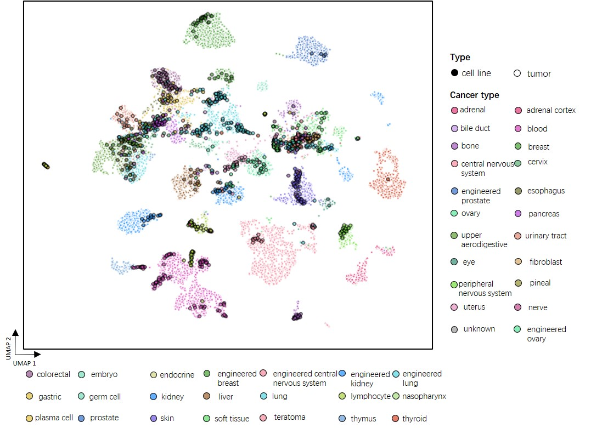

Alignment of Tumors and Cell Lines
==================================

In this tutorial, we show how to apply ``CellMirror`` to align bulk tumor samples and cancer cell lines. As an example, we directly downloaded the RNA-seq data of bulk tumor and cell line samples from `Warren, et al. 2021. <https://www.nature.com/articles/s41467-020-20294-x>`_, including 12,236 cancer samples with 33 cancer types, and 1,249 cell line samples with 34 cancer type. We directly utilized the normalized RNA-seq data by the previous study.

********************************
Step0: Loading packages (Python)
********************************

.. code-block:: python
    :linenos:

    import warnings
    warnings.filterwarnings("ignore")

    import os
    os.environ['R_HOME'] = '/sibcb2/chenluonanlab7/zuochunman/anaconda3/envs/r4.0/lib/R'
    os.environ['R_USER'] = '/sibcb2/chenluonanlab7/zuochunman/anaconda3/envs/CellMirror/lib/python3.8/site-packages/rpy2'

    import random
    import numpy as np
    import scanpy as sc

    from CellMirror_utils.utilities import *
    from CellMirror_utils.layers import *
    from CellMirror_utils.cLDVAE_torch import *
    import torch.utils.data as data_utils

    parser = parameter_setting()
    args = parser.parse_known_args()[0]

    # Set seed
    np.random.seed(args.seed)
    random.seed(args.seed)
    torch.manual_seed(args.seed)
    torch.cuda.manual_seed(args.seed)

    # Changeable parameters
    args.n_hidden_en = [1000]; args.n_hidden_de = [1000]
    args.lr_cLDVAE = 3e-6; args.beta = 1; args.gamma = -100
    args.n_latent_s = 2; args.n_latent_z = 100

    # Set workpath
    Save_path = '/sibcb2/chenluonanlab7/zuochunman/Share_data/xiajunjie/TCGA_CCLE/'

**********************************************
Step1: Reading and preprocessing data (Python)
**********************************************

The necessary input files includes:
1. The gene expression matrix;
2. Samples' attributes;
3. Genes' information.

First, we need to read the RNA-seq data of tumors and cell lines into ``AnnData`` objects. See `AnnData <https://anndata.readthedocs.io/en/latest/index.html>`_ for more details if you are unfamiliar, including how to construct ``AnnData`` objects from scratch, and how to read data in other formats(.csv, .mtx, etc.) into ``AnnData`` objects. Here, we compile a function `Load_TCGA_CCLE_data()` for loading all the aforementioned 3 types of files.

Then, we follow the ``scanpy`` pipeline for data preprocessing. See `scanpy <https://scanpy-tutorials.readthedocs.io/en/latest/pbmc3k.html>`_ for more details if you are unfamiliar. In this scenario, we select 5,000 highly variable genes for tumors and cell lines, respectively. 

To align the number of samples for tumors and cell lines, which will be used in Step2 for training model, we generate random cell line samples from a multivariate normal distribution with the mean vector and covariance matrix of cell line gene expression via the `pseudo_data_padding()` function.

.. code-block:: python
    :linenos:

    # load data & preprocessing
    result = load_TCGA_CCLE_data()
    TCGA_obj = sc.AnnData(X=result[1], obs=result[3], var=result[0])
    CCLE_obj = sc.AnnData(X=result[2], obs=result[4], var=result[0])

    sc.pp.highly_variable_genes(TCGA_obj, n_top_genes=5000)
    sc.pp.highly_variable_genes(CCLE_obj, n_top_genes=5000)
    common_HVGs=np.intersect1d(list(TCGA_obj.var.index[TCGA_obj.var['highly_variable']]),list(CCLE_obj.var.index[CCLE_obj.var['highly_variable']])).tolist()

    TCGA_obj, CCLE_obj = TCGA_obj[:,common_HVGs], CCLE_obj[:,common_HVGs]
    print(len(common_HVGs))

    print('\nShape of target object: ', TCGA_obj.shape, '\tShape of background object: ', CCLE_obj.shape)

    # Last batch setting
    args = set_last_batchsize(args, TCGA_obj, CCLE_obj)

    # Pseudo-data padding
    TCGA_obj.X = TCGA_obj.X - np.mean(TCGA_obj.X, axis=0); CCLE_obj.X = CCLE_obj.X - np.mean(CCLE_obj.X, axis=0)
    pseudo_TCGA, pseudo_CCLE = pseudo_data_padding(TCGA_obj, CCLE_obj)

**Hyperparameters**

- n_top_genes: Number of highly variable genes to keep.

*************************************
Step2: Training cLDVAE model (Python)
*************************************

Next, we train a cLDVAE model for aligning bulk tumor samples and cancer cell lines.

.. code-block:: python
    :linenos:

    # Dataloader preparation
    train = data_utils.TensorDataset(torch.from_numpy(pseudo_TCGA),torch.from_numpy(pseudo_CCLE))
    train_loader = data_utils.DataLoader(train, batch_size=args.batch_size, shuffle=True)

    total = data_utils.TensorDataset(torch.from_numpy(pseudo_TCGA),torch.from_numpy(pseudo_CCLE))
    total_loader = data_utils.DataLoader(total, batch_size=args.batch_size, shuffle=False)

    # Run cLDVAE
    model_cLDVAE = cLDVAE(args=args, n_input=TCGA_obj.shape[1]).cuda()
    history = model_cLDVAE.fit(train_loader, total_loader)

After convergence, the trained model can be used for predicting aligned outputs.

**Hyperparameters**

- batch_size: The batch size for training cLDVAE model. The default value is 128. You can modify it based on your memory size. The larger the parameter, the less time.
- n_hidden_en / n_hidden_de: Number of nodes in the hidden layer of encoder / decoder.
- n_latent_s / n_latent_z: The dimensionality of salient / shared representation vector.
- lr_cLDVAE: Learning rate parameter for training cLDVAE. The default value of the parameters is 3e-6.
- beta: The penalty for the KL divergence. The default value is 1. You can adjust it from 0 to 1 by 0.1.
- gamma: The penalty for the Total Correlation loss.

*************************************
Step3: Saving cLDVAE outputs (Python)
*************************************

To retain the sample size of the processed data, we use the `pseudo_data_deparser()` function for recovering the original number of samples for tumors and cell lines.

.. code-block:: python
    :linenos:

    # Pseudo-data deparsing
    outputs = model_cLDVAE.predict(total_loader)
    TCGA_obj.obsm['cLDVAE'], CCLE_obj.obsm['cLDVAE'] = pseudo_data_deparser(TCGA_obj, outputs['tg_z_outputs'], CCLE_obj, outputs['bg_z_outputs'])

    TCGA_obj.obsm['salient_features'], _ = pseudo_data_deparser(TCGA_obj, outputs['tg_s_outputs'], CCLE_obj, outputs['bg_s_outputs'])

    TCGA_obj.uns['s_loadings'] = model_cLDVAE.get_loadings()[:,-(args.n_latent_s):]

**Output**

This step generates results including shared features of tumors / cell lines and salient features that are specific to tumors stored in ``AnnData.obsm``, linear decoder weights related to salient features stored in ``AnnData.uns``.

You can save these output results in the following format for further downstream analyses:

::

 ── Your work path
    ├─ TCGA_CCLE_data_tumor_X_cLDVAE_only.csv
    ├─ TCGA_CCLE_data_CL_X_cLDVAE_only.csv
    ├─ TCGA_CCLE_data_tumor_salient_features.csv
    └─ TCGA_CCLE_data_salient_loadings_matrix.csv

*************************************************
Step4: Implementing MNN on the processed data (Python)
*************************************************

.. code-block:: R
    :linenos:

    # Run MNN
    TCGA_obj.obsm['CellMirror'], CCLE_obj.obsm['CellMirror'] = mnn_correct(TCGA_obj.obsm['cLDVAE'], CCLE_obj.obsm['cLDVAE'])

    # UMAP embeddings
    adata_concat = sc.concat([TCGA_obj, CCLE_obj], label="type")
    sc.pp.neighbors(adata_concat, n_neighbors=10, metric='correlation',use_rep='CellMirror')
    sc.tl.umap(adata_concat,min_dist=0.5)
    adata_concat.obs = adata_concat.obs.merge(adata_concat.obsm['X_umap'].to_df(), how='inner', left_index=True, right_index=True)
    adata_concat.obs.to_csv(f"TCGA_CCLE_CellMirror_comb_Ann.csv")

**Hyperparameters**

- k1: The number of nearest neighbors of target data in the reference data.
- k2: The number of nearest neighbors of reference data in the target data.
- ndist: The ndist parameter used for MNN. The default value is 3.

**Output**

This step generates files including common features of tumors / cell lines extracted by ``CellMirror`` and corresponding UMAP coordinates.

Save these output results in the following format for running downstream analyses:

::

 ── Your work path
    ├─ TCGA_CCLE_CellMirror_comb_Ann.csv
    ├─ TCGA_CCLE_data_tumor_X_CellMirror.csv
    └─ TCGA_CCLE_data_CL_X_CellMirror.csv

************************
Step5: Visualization (R)
************************

.. code-block:: R
    :linenos:

    library(here)
    library(magrittr)
    library(tidyverse)
    source(here::here('CellMirror_utils','CellMirror_methods.R'))

    alignment <- read.csv('C:\\Users\\我的电脑\\Desktop\\待办\\TCGA_CCLE_CellMirror_comb_Ann.csv')

    p8 <- ggplot2::ggplot(alignment, 
                    ggplot2::aes(X_umap1, X_umap2, fill=lineage, size=type, color = type)) +
    ggplot2::geom_point(pch=21, alpha=0.7)  +
    ggplot2::scale_color_manual(values=c(`CL`='black', `tumor`='white')) +
    ggplot2::scale_size_manual(values=c(`CL`=1, `tumor`=0.75)) +
    ggplot2::theme_void() + 
    ggplot2::theme(legend.position = 'right', 
                    text=ggplot2::element_text(size=8),
                    legend.margin =ggplot2::margin(0,0,0,0),
                    plot.title = ggplot2::element_text(hjust=0.5),
                    legend.key.size = unit(10,'point')) +
    ggplot2::guides(fill=guide_legend(order=1,ncol=3,override.aes = list(size = 5)),size='none', color='none') +
    ggplot2::scale_fill_manual(values=tissue_colors) +
    ggplot2::xlab("UMAP 1") +
    ggplot2::ylab("UMAP 2")

