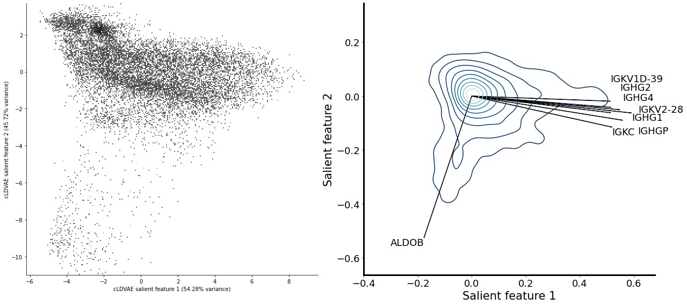
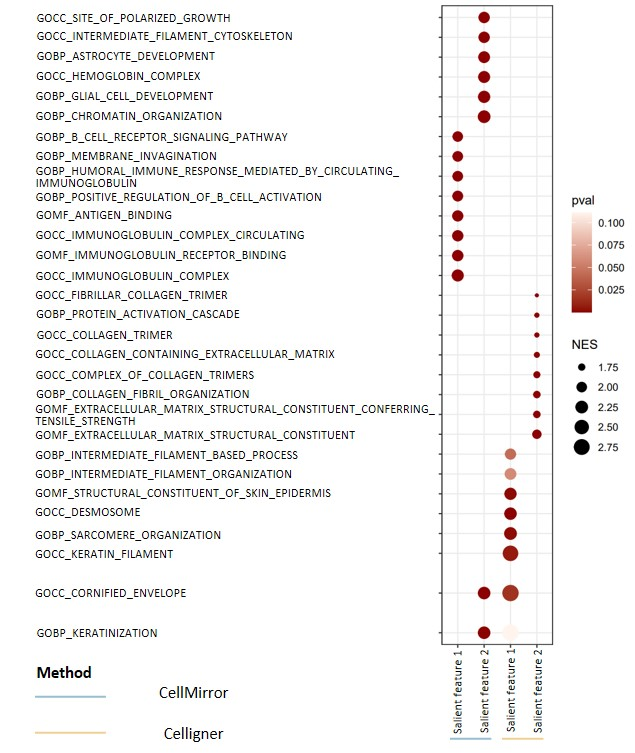
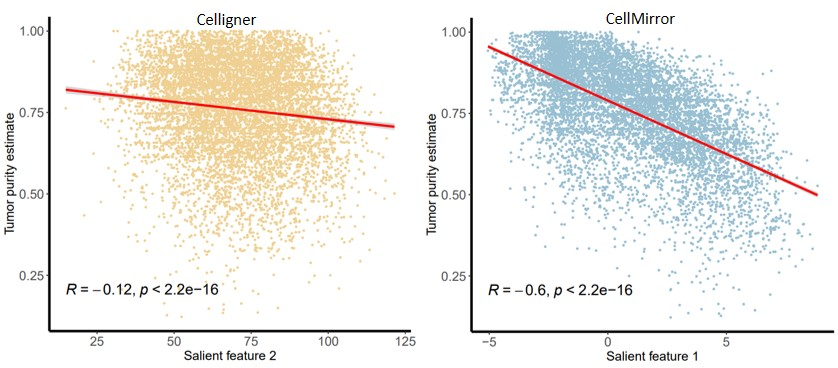

Biological Interpretability
===========================

In this tutorial, we will show how to explain the extracted features using CellMirror feature embeddings and linear decoder weights of cLDVAE.
We continue with the previous example of tumros and cell lines data integration.

**********************************************************
Kernal density plot of features and related genes (Python)
**********************************************************

.. code-block:: python
    :linenos:

    import pandas as pd
    import numpy as np
    from matplotlib import pyplot as plt
    import matplotlib.colors as mcolors

    Z_df = pd.read_csv(r"en[1000]_de[1000]_cLDVAE_only_TCGA_salient_features_lr3e-06_beta1_gamma-100_bs128_dim2_time2023-03-22 12_31_29.044376.csv",index_col=0)
    W_df = pd.read_csv(r"en[1000]_de[1000]_cLDVAE_only_salient_loadings_matrix_lr3e-06_beta1_gamma-100_bs128_time2023-03-22 12_31_29.075603.csv",index_col=0)

    def Z_covariance(Z):
        Zcentered = Z - Z.mean(0)
        Zscaled = Zcentered / Z.std(0)
        ZTZ = np.cov(Zscaled.T)
        
        eigen_values, _ = np.linalg.eig(ZTZ)
        singular_values = np.sqrt(eigen_values)
        variance_explained = singular_values / singular_values.sum()

        return ZTZ, variance_explained

    _, variance_explained = Z_covariance(Z_df)
    idx = np.argsort(variance_explained)[::-1]

    variance_explained_df = pd.DataFrame({'variance_explained':variance_explained[idx]},index=idx+1)

    Z_df_ordered = Z_df.iloc[:,idx]
    W_df_ordered = W_df.iloc[:,idx]

    gene_stats=pd.read_csv(r"common_HVGs_noScale_stats_SD_mean_time2023-01-20 13_48_31.884973.csv",index_col=0)

    W_df_ordered = W_df_ordered.merge(gene_stats.loc[W_df_ordered.index,['symbol']], how='inner', left_index=True, right_index=True)

    text_shift = { (0, 'IGHG1'): (0, 0),
               (0, 'IGHG4'): (0, 0.1),
               (0, 'ALDOB'): (0, 0),
               (0, 'IGHG2'): (0, 0.1),
               (0, 'IGKC'): (0, 0),
               (0, 'IGHGP'): (0.1, -0.05),
               (0, 'IGKV2-28'): (0.1, 0.01),
               (0, 'IGKV1D-39'): (0, 0.1) }
    
    import seaborn as sns

    plt.figure(figsize=(18,8))

    for i in range(1):

        # -- tg_s plot -- 

        plt.subplot(1, 2, 2 * i + 1)

        plt.hist2d(
            Z_df_ordered[f's{2 * i + 1}'], Z_df_ordered[f's{2 * (i + 1)}'],
            bins=256,
            norm=mcolors.PowerNorm(0.25),
            cmap=plt.cm.gray_r,
            rasterized=True
        )

        plt.axis('equal');
        plt.xlabel(f'cLDVAE salient feature {2 * i + 1} ({round(variance_explained_df.loc[2 * i +1].values[0] * 100, 2)}% variance)')
        plt.ylabel(f'cLDVAE salient feature {2 * (i + 1)} ({round(variance_explained_df.loc[2 * (i +1)].values[0] * 100, 2)}% variance)')

        ax = plt.gca()
        ax.spines['top'].set_visible(False)
        ax.spines['right'].set_visible(False)

        # -- W plot -- 

        plt.subplot(1, 2, 2 * (i + 1))

        w_columns = [f's{2 * i + 1}', f's{2 * (i + 1)}']

        sns.kdeplot(
            W_df_ordered[w_columns[0]], W_df_ordered[w_columns[1]],
            cmap='Blues_r',
            rasterized=True
        )

        plt.axis('equal');
        plt.xlabel(f'Salient feature {2 * i + 1}',fontdict={'size':21})
        plt.ylabel(f'Salient feature {2 * (i + 1)}',fontdict={'size':21})
        plt.xticks(size=18)
        plt.yticks(size=18)

        tmp_ = W_df_ordered.copy()
        tmp_['lnth'] = np.linalg.norm(tmp_[w_columns], axis=1)
        
        ggg=tmp_.sort_values('lnth', ascending=False).head(8)[['symbol', 'lnth', *w_columns]]
        print(ggg[['symbol', *w_columns]].values)

        texts = []
        arrows = []
        for g, r in ggg.iterrows():
            x_, y_ = r[w_columns[0]], r[w_columns[1]]
            
            ha = 'right'
            if x_ > 0:
                ha = 'left'
                
            va = 'top'
            if y_ > 0:
                va = 'bottom'
                
            arrows.append(plt.arrow(0, 0, x_, y_, length_includes_head=True, color='k'))

            xs, ys = 0, 0
            if (i, r.symbol) in text_shift:
                xs, ys = text_shift[(i, r.symbol)]
                texts.append(plt.text(x_ + xs, y_ + ys, r.symbol, ha=ha, va=va,fontdict={'fontsize':18}))

        ax = plt.gca()
        ax.spines['top'].set_visible(False)
        ax.spines['bottom'].set_linewidth(3)
        ax.spines['right'].set_visible(False)
        ax.spines['left'].set_linewidth(3)

    plt.tight_layout()

*******************************************************
Gene set enrichment analysis for extracted features (R)
*******************************************************

.. code-block:: R
    :linenos:

    library(here)
    library(magrittr)
    library(tidyverse)
    source(here::here('CellMirror_utils','CellMirror_methods.R'))

    s.loadings<-read.csv('C:\\Users\\我的电脑\\Desktop\\待办\\en[1000]_de[1000]_cLDVAE_only_salient_loadings_matrix_lr3e-06_beta1_gamma-100_bs128_time2023-03-22 12_31_29.075603.csv')
    gene_stats<-read.csv('C:\\Users\\我的电脑\\Desktop\\待办\\common_HVGs_noScale_stats_SD_mean_time2023-01-20 13_48_31.884973.csv')
    colnames(s.loadings)[1]<-'ensembl_gene_id'
    colnames(gene_stats)[1]<-'ensembl_gene_id'
    df<-s.loadings%>%dplyr::left_join(gene_stats[,c('ensembl_gene_id','symbol')],by='ensembl_gene_id')
    rownames(df)<-df$ensembl_gene_id
    df<-df[,-1]

    gsc_data <- GSEABase::getGmt("C:\\Users\\我的电脑\\Desktop\\待办\\c5.go.v2022.1.Hs.symbols.gmt")

    i <- 2
    gene_stat<-set_names(df[,i],df$symbol)

    cPCA_GSEA <- run_fGSEA(gsc = gsc_data,
                        gene_stat = gene_stat,
                        nperm = 1e5,
                        perm_type = 'gene') %>%
    dplyr::arrange(dplyr::desc(NES)) %>%
    dplyr::select(-leadingEdge)

    cPCA_GSEA_data <- rbind.data.frame(cPCA_GSEA %>% dplyr::arrange(dplyr::desc(NES)) %>% head(8))
    cPCA_GSEA_data$pathway <- factor(cPCA_GSEA_data$pathway, levels = cPCA_GSEA_data$pathway) 
    cPCA_GSEA_data$pathway <- factor(cPCA_GSEA_data$pathway, levels = unique(cPCA_GSEA_data$pathway))
    cPCA_GSEA_data <- as.data.frame(cPCA_GSEA_data)
    cPCA_GSEA_data$pval <- signif(cPCA_GSEA_data$pval, 3)
    cPCA_GSEA_data$`adjusted pval` <- signif(cPCA_GSEA_data$padj, 3)
    cPCA_GSEA_data$NES <- signif(cPCA_GSEA_data$NES, 3)

    cPCA_1<-cPCA_GSEA_data[,c('pathway','NES','pval')]
    colnames(cPCA_1)<-c('pathway','cPCA salient feature 1 NES','cPCA salient feature 1 pval')

    cPCA_2<-cPCA_GSEA_data[,c('pathway','NES','pval')]
    colnames(cPCA_2)<-c('pathway','cPCA salient feature 2 NES','cPCA salient feature 2 pval')

    cLDVAE_1<-cPCA_GSEA_data[,c('pathway','NES','pval')]
    colnames(cLDVAE_1)<-c('pathway','cLDVAE salient feature 1 NES','cLDVAE salient feature 1 pval')

    cLDVAE_2<-cPCA_GSEA_data[,c('pathway','NES','pval')]
    colnames(cLDVAE_2)<-c('pathway','cLDVAE salient feature 2 NES','cLDVAE salient feature 2 pval')

    temp<-cPCA_1 %>% dplyr::full_join(cPCA_2, by="pathway") %>% dplyr::full_join(cLDVAE_1, by="pathway") %>% dplyr::full_join(cLDVAE_2, by="pathway")

    data<-c()
    for (p in temp$pathway){
    for (f in c("cPCA salient feature 1 NES","cPCA salient feature 2 NES","cLDVAE salient feature 1 NES","cLDVAE salient feature 2 NES")){
        if(!is.na(temp[temp$pathway==p,f])){
        add<-c(p,f,temp[temp$pathway==p,f])
        data<-rbind(data,add)
        }
    }
    }
    data<-as.data.frame(data)
    colnames(data)<-c("pathway","feature","NES")
    for (p in data$pathway){
    for (f in data$feature){
        data[(data$pathway==p & data$feature==f),"pval"]<-temp[temp$pathway==p,str_replace(f,"NES","pval")]
    }
    }
    data$feature<-sapply(data$feature,function(x) str_replace(x,pattern = "NES",replacement = ""))
    data$NES<-as.numeric(data$NES)

    ggplot(data = data, aes(x=feature,y=pathway))+
    geom_point(aes(color=pval,size=NES))+
    scale_color_continuous(high="#fff5ee",low="#8b0000")+
    #scale_color_continuous(high="#FFFFCC",low="#FD6E32")+
    #scale_color_continuous(high="#55B0F5",low="#28547A")+
    theme_bw()+
    guides()+
    theme(axis.text.x = element_text(size=9),
            axis.text.y = element_text(size=9))+
    scale_y_discrete(limits=data$pathway)

**********************************************************
Scatter plot between salient features and tumor purity (R)
**********************************************************

.. code-block:: R
    :linenos:

    library(magrittr)
    ann<-read.csv('C:\\Users\\我的电脑\\Desktop\\待办\\en[1000]_de[1000]_s2_z100_beta1_gamma-100_lr3e-6_4th_cLDVAE_mnn_k1_80_k2_100_comb_Ann_agg0.612_time2023-03-23 01_50_42.573336.csv')
    tg_s<-read.csv('C:\\Users\\我的电脑\\Desktop\\待办\\en[1000]_de[1000]_cLDVAE_only_TCGA_salient_features_lr3e-06_beta1_gamma-100_bs128_dim2_time2023-03-22 12_31_29.044376.csv')
    tg_s_cPCA<-read.csv('C:\\Users\\我的电脑\\Desktop\\待办\\cPCA_only_salient_features_s2_z100 2023-03-23 02_19_53 .csv')
    colnames(tg_s)[1]<-'sampleID'
    colnames(tg_s_cPCA)[1]<-'sampleID'
    tumor_ann<-ann[!is.na(ann$purity) & ann$type=='tumor', ]

    df <- tg_s %>% dplyr::inner_join(tumor_ann[,c('sampleID','purity')], by = 'sampleID') %>% dplyr::left_join(tg_s_cPCA, by='sampleID')

    purity<-df$purity
    salients<-df[,c('s1','s2','PC1','PC2')]

    library(lars)

    model.lasso<-lars(as.matrix(salients),purity,type='lasso')
    plot(model.lasso)
    #summary(model.lasso)

    cv.model.lasso<-cv.lars(as.matrix(salients),purity,K=10)
    select<-cv.model.lasso$index[which.min(cv.model.lasso$cv)]
    coef<-coef.lars(model.lasso,mode='fraction',s=select)
    coef[which(coef!=0)]
    coef[which.min(coef)]

    p4<-ggplot2::ggplot(salients, 
                    ggplot2::aes(salients[,'PC2'], purity)) + 
    ggplot2::geom_point(size=0.5,col='#EFD092') + 
    ggplot2::ylab('Tumor purity estimate') + 
    ggplot2::xlab('Salient feature 2') +
    ggpubr::stat_cor(label.y.npc = 'bottom', size=5) +
    ggplot2::geom_smooth(method = 'lm',col='Red') +
    ggplot2::theme_classic() +
    ggplot2::theme(axis.text=ggplot2::element_text(size=12),
                    axis.title.x = ggplot2::element_text(size=12),
                    axis.title.y = ggplot2::element_text(size=12),
                    axis.line = element_line(size=1.1))

