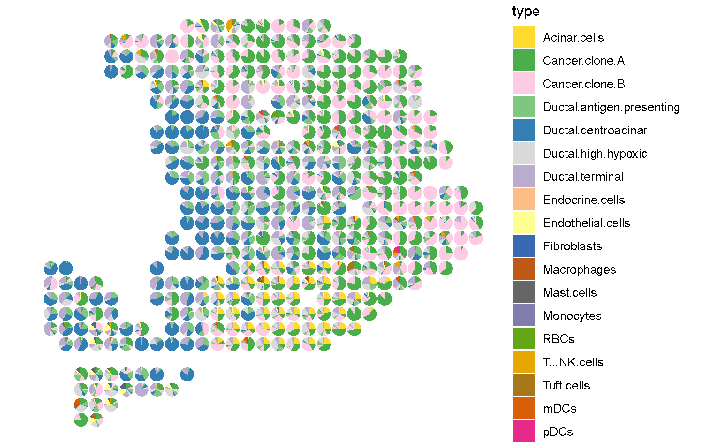

Integrating ST adn scRNA-seq Data
=================================

In this tutorial, we show how to apply ``CellMirror`` to integrate ST and scRNA-seq data.
As an example, we use the ST data and paired scRNA-seq data of pancreatic ductal adenocarcinoma (PDAC) patient from `Moncada , et al. 2020. <https://www.nature.com/articles/s41587-019-0392-8>`_,
including 428 spots and 1,926 cells.

********************************
Step0: Loading packages (Python)
********************************

.. code-block:: python
    :linenos:

    import warnings
    warnings.filterwarnings("ignore")

    import os
    os.environ['R_HOME'] = '/sibcb2/chenluonanlab7/zuochunman/anaconda3/envs/r4.0/lib/R'
    os.environ['R_USER'] = '/sibcb2/chenluonanlab7/zuochunman/anaconda3/envs/CellMirror/lib/python3.8/site-packages/rpy2'

    import random
    import numpy as np
    import scanpy as sc
    import matplotlib.pyplot as plt

    from CellMirror_utils.utilities import *
    from CellMirror_utils.layers import *
    from CellMirror_utils.cLDVAE_torch import *
    import torch.utils.data as data_utils

    parser = parameter_setting()
    args = parser.parse_known_args()[0]

    # Set seed
    np.random.seed(args.seed)
    random.seed(args.seed)
    torch.manual_seed(args.seed)
    torch.cuda.manual_seed(args.seed)

    args.lr_cLDVAE = 1e-5; args.gamma = -100

    # Set workpath
    Save_path = '/sibcb2/chenluonanlab7/zuochunman/Share_data/xiajunjie/PDAC/'

**********************************************
Step1: Reading and preprocessing data (Python)
**********************************************

.. code-block:: python
    :linenos:

    # Normalization
    PDAC_A_st = sc.read_h5ad(Save_path + 'PDAC_A_st.h5ad')
    PDAC_A_st.obs['type'] = 'Spatial'
    PDAC_A_st.obs['y'] = 100 - PDAC_A_st.obs['y'] 
    PDAC_A_st.obsm['spatial'] = PDAC_A_st.obs[['x','y']].values
    sc.pp.normalize_total(PDAC_A_st)
    sc.pp.log1p(PDAC_A_st)
    sc.pp.highly_variable_genes(PDAC_A_st, flavor='seurat', n_top_genes=3000)

    PDAC_A_sc = sc.read_h5ad(Save_path + 'PDAC_A_sc.h5ad')
    PDAC_A_sc.obs['type'] = 'SingleCell'
    sc.pp.normalize_total(PDAC_A_sc)
    sc.pp.log1p(PDAC_A_sc)
    sc.pp.highly_variable_genes(PDAC_A_sc, flavor='seurat', n_top_genes=3000)

    common_HVGs=np.intersect1d(list(PDAC_A_sc.var.index[PDAC_A_sc.var['highly_variable']]),list(PDAC_A_st.var.index[PDAC_A_st.var['highly_variable']])).tolist()
    print(len(common_HVGs))

    PDAC_A_st, PDAC_A_sc = PDAC_A_st[:,common_HVGs], PDAC_A_sc[:,common_HVGs]

    print('\nShape of target object: ', PDAC_A_st.shape, '\tShape of background object: ', PDAC_A_sc.shape)

    # Last batch setting
    args = set_last_batchsize(args, PDAC_A_st, PDAC_A_sc)

    # Pseudo-data padding
    pseudo_st, pseudo_sc = pseudo_data_padding(PDAC_A_st, PDAC_A_sc)

*************************************
Step2: Training cLDVAE model (Python)
*************************************

.. code-block:: python
    :linenos:

    # Dataloader preparation
    train = data_utils.TensorDataset(torch.from_numpy(pseudo_st),torch.from_numpy(pseudo_sc))
    train_loader = data_utils.DataLoader(train, batch_size=args.batch_size, shuffle=True)

    total = data_utils.TensorDataset(torch.from_numpy(pseudo_st),torch.from_numpy(pseudo_sc))
    total_loader = data_utils.DataLoader(total, batch_size=args.batch_size, shuffle=False)

    # Run cLDVAE
    model_cLDVAE = cLDVAE(args=args, n_input=PDAC_A_st.shape[1]).cuda()
    history = model_cLDVAE.fit(train_loader, total_loader)

*************************************
Step3: Saving cLDVAE outputs (Python)
*************************************

.. code-block:: python
    :linenos:

    # Pseudo-data deparsing
    outputs = model_cLDVAE.predict(total_loader)
    PDAC_A_st.obsm['cLDVAE'], PDAC_A_sc.obsm['cLDVAE'] = pseudo_data_deparser(PDAC_A_st, outputs['tg_z_outputs'], PDAC_A_sc, outputs['bg_z_outputs'])

*************************************************
Step4: Implementing MNN on the processed data (Python)
*************************************************

.. code-block:: Python
    :linenos:

    # Run MNN
    PDAC_A_st.obsm['CellMirror'], PDAC_A_sc.obsm['CellMirror'] = mnn_correct(PDAC_A_st.obsm['cLDVAE'], PDAC_A_sc.obsm['cLDVAE'])

    # Cell type estimation
    PDAC_A_st, PDAC_A_sc = estimate_cell_type(PDAC_A_st, PDAC_A_sc, used_obsm='CellMirror', used_label='cell_type_ductal', neighbors=50)

***********************************************
Step5: Saving results for further visualization (Python)
***********************************************

.. code-block:: Python
    :linenos:

    # Save data
    colors = np.unique(PDAC_A_sc.obs['cell_type_ductal'].values).tolist()
    sc.pl.spatial(PDAC_A_st, img_key=None, color=colors, color_map=plt.cm.get_cmap('plasma'), ncols=5, spot_size=1, frameon=False, show=False)
    plt.savefig(Save_path + 'PDAC_A_CellMirror_celltype_proportion.jpg', dpi=100)

    PDAC_A_st.obs.to_csv(Save_path + 'PDAC_st_CellMirror_celltype_proportion.csv')
    PDAC_A_st.write(Save_path + 'PDAC_A_CellMirror.h5ad', compression='gzip')

************************
Step6: Visualization (R)
************************

.. code-block:: R
    :linenos:

    PDAC_st <- read.csv('C:\\Users\\我的电脑\\Desktop\\待办\\PDAC_st_CellMirror_celltype_proportion.csv')
    celltypes <- colnames(PDAC_st)[11:dim(PDAC_st)[2]]

    suppressMessages(
    ggplot2::ggplot() 
    + scatterpie::geom_scatterpie(data = PDAC_st, ggplot2::aes(x = x,y = y), cols = celltypes, color = NA,alpha = 1, pie_scale = 0.8) 
    + ggplot2::scale_y_reverse() 
    + ggplot2::theme_void()
    + ggplot2::coord_fixed(ratio = 1,xlim = NULL, ylim = NULL, expand = TRUE, clip = "on")
    + ggplot2::scale_fill_manual(values = c('Acinar.cells'='#FEDB2C', 
                                            'Cancer.clone.A'='#4AAE4B', 
                                            'Cancer.clone.B'='#FDCBE4',
                                            'Ductal.antigen.presenting'='#7DC87E',
                                            'Ductal.centroacinar'='#337FB4',
                                            'Ductal.high.hypoxic'='#D9D9D9',
                                            'Ductal.terminal'='#BAACCF',
                                            'Endocrine.cells'='#FCBE84',
                                            'Endothelial.cells'='#FFFF91',
                                            'Fibroblasts'='#386AB2',
                                            'Macrophages'='#BC5914',
                                            'Mast.cells'='#656666',
                                            'Monocytes'='#817EAE',
                                            'RBCs'='#63A618',
                                            'T...NK.cells'='#E7A703',
                                            'Tuft.cells'='#A8771A',
                                            'mDCs'='#D95E08',
                                            'pDCs'='#E72989')))

