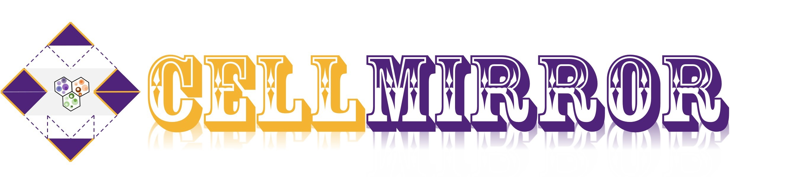
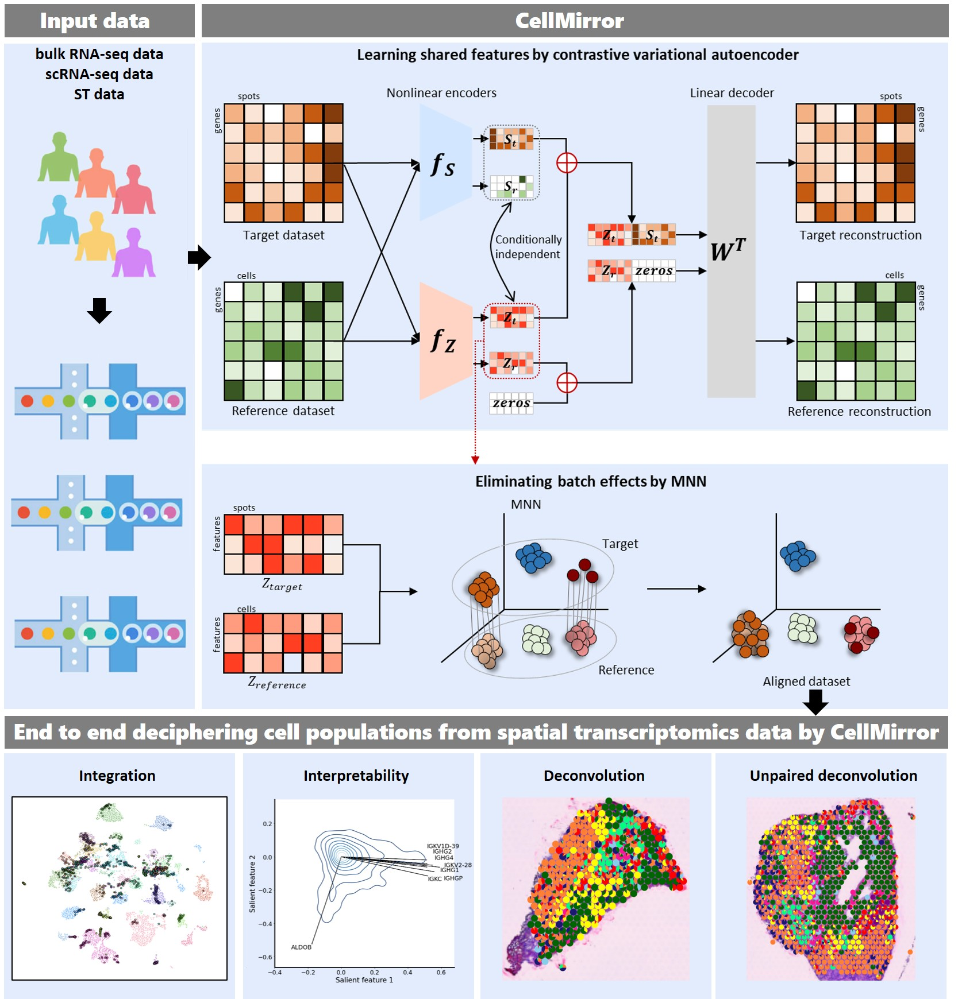

.. CellMirror documentation master file, created by
   sphinx-quickstart on Fri Aug  4 11:05:16 2023.
   You can adapt this file completely to your liking, but it should at least
   contain the root `toctree` directive.

Welcome to CellMirror's documentation !
=======================================

Graphical abstract
==================

Highlights
==========

* CellMirror enbales learning a biologically meaningful common feature space

* CellMirror contributes to learning interpretable features

* CellMirror facilitates detecting finer domains from ST data missed by competing methods

* CellMirror is robust to decipher cell populations from ST data by unpaired scRNA-seq data

.. toctree::
   :maxdepth: 2
   :caption: Install CellMirror

   Installation

.. toctree::
   :maxdepth: 2
   :caption: Get Started

   Introduction

.. toctree::
   :maxdepth: 2
   :caption: Tutorials

   Alignment of Tumors and Cell Lines
   
   Biological Interpretability

   Integrating ST and scRNA-seq Data

.. toctree::
   :maxdepth: 1
   :caption: Credits

   Credits

Citation
========

* Xia J, Cui J, Huang Z, Zhang S, Yao F, Zuo C. CellMirror: Deciphering Cell Populations from Spatial Transcriptomics Data by Interpretable Contrastive Learning. 2023.